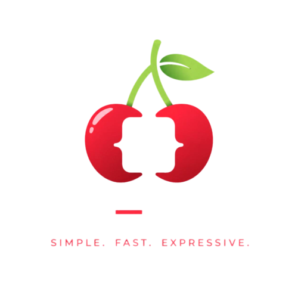
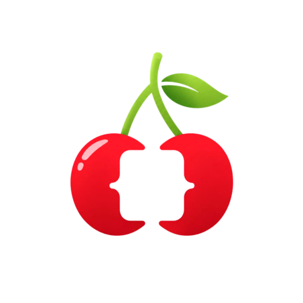

<div align="center">



# Cherry

A fast, simple, Rust-powered programming language.

**Easy to learn. Fast to run. Built for developers.**

**Single-file executable • Native packages**

</div>

---

## What is Cherry?

Cherry is an independent programming language written in Rust. While Cherry itself is implemented in Rust, Cherry programs are **not Rust programs** and do not require Rust to execute. Cherry has its own lexer, parser, runtime, package manager, and execution engine.

Cherry was created as a hobby project with a simple goal:

> Build a language that feels as easy and productive as Python while providing a cleaner architecture, faster parsing, native extensibility, and a modern package system.

Unlike wrappers, transpilers, or Python frontends, Cherry executes its own source code through the Cherry runtime.

```text
Cherry Source (.ch)
        ↓
   Cherry Parser
        ↓
   Cherry Runtime
        ↓
      Output
```

Rust powers the implementation, but Rust does not execute Cherry programs. The Cherry runtime does.

---

## Why Cherry?

* Simple syntax inspired by Python
* Fast Rust-powered implementation
* Custom parser designed for speed and simplicity
* Native package system
* Cross-platform package support
* Easy-to-read code
* Designed for hobbyists, students, and developers
* Built to grow beyond Python's limitations
* Native Rust extension support
* Standalone executable with minimal dependencies

---

## Platform Support

Cherry is currently developed and tested primarily on **Linux**.

Current support status:

| Platform | Status         |
| -------- | -------------- |
| Linux    | Supported      |
| Windows  | In Development |
| macOS    | Not planned        |

Windows support is actively being worked on and will be available in a future release. While some parts of Cherry may compile or function on other operating systems, Linux is currently the only officially supported platform.

As the runtime, package manager, and native package system mature, support for additional platforms will continue to expand.

---

## Installation

Cherry is distributed as a standalone Linux ELF executable.

No Rust installation, compiler, interpreter, or external runtime is required to run Cherry programs.

After downloading Cherry:

```bash
chmod +x cherry
./cherry
```

To make Cherry available system-wide from any terminal, run:

```bash
./cherry bootstrap
```

The bootstrap command installs Cherry into your PATH and performs any required first-time setup.

After bootstrapping:

```bash
cherry
```

can be run from anywhere on the system.

### Native Package Development

Rust is **not required** to run Cherry or use existing Cherry packages.

However, Rust **is required** to build native `.chy` packages.

To install Rust:

```bash
curl --proto '=https' --tlsv1.2 -sSf https://sh.rustup.rs | sh
```

Verify the installation:

```bash
rustc --version
cargo --version
```

Cherry uses Rust's tooling to compile native packages into platform-specific libraries that can be distributed through the `.chy` package format.

---

## Running Programs

Run a Cherry script:

```bash
cherry run main.ch
```

Create a new project:

```bash
cherry new MyProject
```

Install a package:

```bash
cherry install mathplus.chy
```

List installed packages:

```bash
cherry list
```

View available commands:

```bash
cherry help
```

---

## Native Packages

Cherry packages use the `.chy` format.

A `.chy` package is a compressed package archive containing metadata and native modules built in Rust.

```text
mathplus.chy
├── Ident.toml
├── README.md
└── bin/
```

Packages can expose functions directly to Cherry:

```cherry
import mathplus

print(mathplus.add(5, 10))
```

Native packages are compiled for their target platforms and can provide high-performance functionality while remaining easy to use from Cherry code.

A package may contain builds for multiple operating systems and architectures, with SHA256 verification performed during installation.

---

## Example

```cherry
import mathplus

fn main() {
    let result = mathplus.add(5, 10)
    print(result)
}
```

---

## Development

Cherry is primarily developed with assistance from OpenAI's GPT-5.5. Large portions of the codebase, architecture, documentation, and prototypes are generated with AI assistance.

All generated code is reviewed, modified, debugged, optimized, and maintained by me. Many systems have been manually adjusted, improved, and refactored beyond their original generated versions.

Cherry is an experiment in combining human creativity with AI-assisted software development.

---

## Goals

Cherry aims to be:

* Simpler than large modern languages
* Faster to parse than traditional scripting languages
* Easy to extend with native modules
* Friendly for beginners
* Powerful enough for real projects
* Fun to experiment with and build
* Easy to distribute and run
* Consistent across platforms

---

## Warning

Cherry is currently an experimental hobby project.

Cherry is under active development and is **not recommended for security-sensitive, safety-critical, or commercial production applications at this time**.

This includes, but is not limited to:

* Authentication systems
* Financial software
* Medical software
* Critical infrastructure
* Enterprise production systems
* Security tools
* Government systems

The language, runtime, package system, APIs, and specifications may change without notice, and bugs or security issues may exist.

Use Cherry for learning, experimentation, hobby projects, prototypes, and exploration while the language matures.

---

## Status

**Early Development**

Features, syntax, package formats, APIs, and runtime behavior are subject to change as the language evolves.

